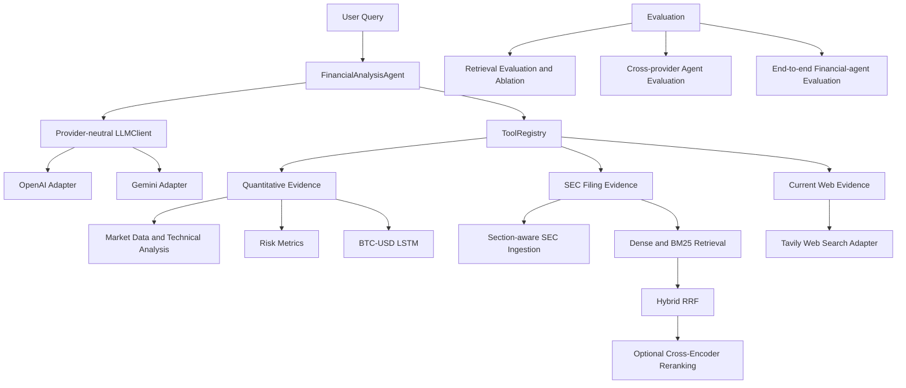

# Financial Research Agent

> A tool-using financial research system that combines deterministic market analysis, SEC filing evidence, current web evidence, and a BTC-USD-specific ML signal.

This repository is an evidence-oriented financial research project, not a generic chatbot, trading bot, or production investment system. A provider-neutral LLM layer coordinates selected tools and synthesizes their outputs. Quantitative calculations, SEC retrieval, and web search remain separate application-owned capabilities with structured results, provenance, traces, and limitations.

The original BTC LSTM project remains part of the repository as a deliberately bounded quantitative capability. It is useful context for the system's history, but it does not predict arbitrary equities or drive automated trading.

## What This Project Demonstrates

- Provider-neutral LLM tool calling with OpenAI and Gemini adapters.
- Deterministic market, technical-analysis, risk, and BTC-USD LSTM tools.
- Section-aware SEC 10-K and 10-Q ingestion with stable metadata and provenance.
- Local dense, lexical BM25, hybrid RRF, and optional cross-encoder retrieval.
- Provider-neutral current-information web search with a Tavily adapter.
- Tool traces, structured limitations, and evaluation-driven engineering.

In this design, the LLM is responsible for **orchestration and synthesis**. It is not the numerical financial predictor, SEC parser, retriever, or web-search provider.

## Key Capabilities

| Capability | What it provides |
| --- | --- |
| Quantitative evidence | Market data, project-defined indicators, return risk metrics, and compact market analysis. |
| BTC-specific ML | A PyTorch LSTM classification signal for `BTC-USD` only. |
| SEC filing evidence | Deterministic ingestion and local retrieval over configured 10-K and 10-Q filings. |
| Current web evidence | Bounded title, URL, snippet, source, and publication-date metadata through an application-owned search tool. |
| Provider neutrality | The same `FinancialAnalysisAgent` and `ToolRegistry` work with OpenAI or Gemini tool-calling adapters. |
| Evaluation | Deterministic retrieval, tool-routing, planning, provenance, limitation, and end-to-end evidence-handling evaluation. |

## Architecture



All model-requested functions are validated and executed through `ToolRegistry`. Provider adapters translate the same provider-neutral tool definitions into their respective SDK formats; they do not own financial logic or directly invoke project callables.

## Evidence Routing

| Question type | Intended evidence source |
| --- | --- |
| Historical market behavior | Quantitative tools |
| Technical indicators or risk metrics | Quantitative tools |
| A specific 10-K or 10-Q disclosure | Local SEC retrieval |
| Current, latest, or recent event | Web search |
| Broader research question | A controlled combination of the relevant evidence families |

Keeping these sources separate is intentional. A historical market result is not evidence of a current event; a web snippet is not a substitute for a filing disclosure; and a local filing corpus is not a current-news source.

## Example Research Workflows

The following are representative prompts, not fabricated example outputs:

- `What is RSI?`
- `Analyze NVDA from 2026-01-01 to 2026-06-30.`
- `What supply-chain risks does Apple disclose in its filings?`
- `What are the latest developments involving NVIDIA?`
- `Compare recent MSTR Bitcoin developments with risks disclosed in its SEC filings.`
- `Analyze BTC-USD using quantitative evidence and the BTC-specific LSTM.`

A mixed MSTR question can combine MSTR market evidence, MSTR SEC evidence, and current web evidence. BTC model output remains separate BTC-specific context and is never treated as an MSTR prediction.

## SEC Filing RAG Pipeline

The current controlled evaluation corpus contains the latest configured `10-K` and `10-Q` filings for `NVDA`, `AAPL`, and `MSTR`. CIK is the stable SEC identity; ticker metadata is retained for filtering and citations. This is a small evaluation corpus, not a production-scale SEC archive.

```text
Official SEC EDGAR filing
        |
        v
HTML cleanup and section normalization
        |
        v
Section-aware chunking with filing metadata
        |
        v
Dense embeddings and BM25 lexical index
        |
        v
Metadata filtering and hybrid RRF
        |
        v
Optional cross-encoder reranking
        |
        v
search_financial_documents
```

The ingestion pipeline preserves official source URLs, filing date, reporting period, document type, section identifiers, section titles, and deterministic document/chunk IDs. It stores processed documents and chunks as JSONL, with raw filing HTML cached separately. Section detection is deterministic and best-effort; unclassified content is retained as `UNKNOWN` rather than discarded. Tables are preserved as text, but the project does not perform advanced table interpretation.

`search_financial_documents` returns compact chunk-level evidence with SEC provenance. It supports ticker, document type, section, and filing-date filters. Section filtering uses normalized, case-insensitive exact matching against either the canonical identifier (for example, `PART I ITEM 1A`) or the title (for example, `Risk Factors`).

## Quantitative Analysis and the BTC LSTM

The deterministic `analyze_market(symbol, start_date, end_date)` orchestration keeps DataFrames internal to Python and returns a compact JSON-safe result containing market summary information, project-defined technical indicators, market-return risk metrics, and LSTM status where appropriate.

The historical ML component is intentionally narrow:

- Asset applicability: `BTC-USD` only.
- Sequence length: 30 daily observations.
- Model: PyTorch LSTM classifier.
- Output: `probability_up = P(Target = 1)`.
- Target: `Target = 1` when `Future_Return > 0.005`.
- Threshold labels: probability above `0.52` yields raw signal `+1`, below `0.48` yields raw signal `-1`, and otherwise `0`.

Raw signal is not a long/short exposure. The historical backtest deliberately preserves its contrarian convention: exposure is the negated raw signal, and strategy returns use that exposure times the next-day market return. The model and backtest are experimental research artifacts, not deployable trading performance.

## Retrieval Evaluation

Phase 3.3 introduced a separate manually judged retrieval benchmark (`phase-3.3-manual-v1`) with positive and negative cases. It records relevance labels at the chunk level, diagnostic ranks, category breakdowns, and failure annotations without an LLM judge. Phase 3.4 then evaluated four retrieval variants on exactly that benchmark.

| Retriever | Hit@5 | Hit@10 | Recall@10 | nDCG@10 | MRR |
| --- | ---: | ---: | ---: | ---: | ---: |
| Dense | .444 | .556 | .519 | .309 | .247 |
| BM25 | .407 | .593 | .593 | .320 | .235 |
| Hybrid | .444 | .667 | .630 | .354 | .277 |
| Hybrid + reranker | .593 | .704 | .685 | .405 | .315 |

These numbers are benchmark-specific and are not claims of statistical significance or universal retrieval quality. Hybrid improved candidate coverage over dense retrieval in this corpus and is the default production composition because it offers a practical latency/coverage trade-off. `hybrid_reranked` achieved the strongest fixed-benchmark ranking metrics, but the local cross-encoder adds substantial CPU latency and remains an optional quality mode.

The retrieval stack is local and provider-neutral. It uses exact normalized cosine similarity for dense candidates, a deterministic lowercase word tokenizer for BM25, Reciprocal Rank Fusion rather than raw-score averaging, and optional reranking only over a bounded candidate set.

## Agent and End-to-End Evaluation

The project keeps several evaluation layers separate:

| Evaluation layer | What it measures |
| --- | --- |
| Phase 2 agent evaluation | Tool routing, required calls, duplicate/extra calls, and limitations across provider-neutral traces. |
| Phase 2.8 cross-provider evaluation | The same agent benchmark executed separately against OpenAI and Gemini. |
| Phase 3.3 retrieval analysis | Manually judged chunk ranking, failure diagnostics, and negative-query behavior. |
| Phase 3.4 retrieval ablation | Dense, BM25, hybrid, and hybrid-reranked retrieval behavior on fixed labels. |
| Phase 4.0 E2E evaluation | Routing, evidence availability, provenance, capability boundaries, and planning behavior for the complete research agent. |

The fixed end-to-end benchmark is `financial-agent-e2e-v1` with 20 cases across conceptual, quantitative, SEC, web, quantitative-plus-SEC, quantitative-plus-web, SEC-plus-web, full evidence mix, BTC applicability, and unavailable-capability scenarios. Its deterministic metrics include:

- required-tool recall, missing calls, forbidden calls, and duplicate calls;
- quantitative, document, and web evidence-family coverage;
- structured SEC and web provenance availability;
- document and web retrieval planning diagnostics; and
- structured limitation preservation.

These metrics evaluate routing and evidence handling. They do **not** independently prove factual correctness for every generated sentence, prose quality, investment quality, or provider intelligence. The earlier eight-case cross-provider run likewise measured tool-use behavior and limitations without declaring a provider winner.

### Controlled Live E2E Findings

A controlled OpenAI five-case live subset covered conceptual, quantitative, SEC, web, and SEC-plus-web scenarios. Observed successful behaviors included:

- The conceptual RSI question used no tools.
- NVDA quantitative analysis used the quantitative analysis tool.
- The BTC-only LSTM applicability limitation was preserved for NVDA.
- Mixed SEC-plus-web research used both evidence families when each was available.
- Returned SEC chunks retained real filing provenance.
- The web-search regression run stayed within the intended two-search planning budget.

The live evaluation also exposed a useful generic correction: an agent may request a human-readable section title such as `Risk Factors`, while corpus chunks use a canonical identifier such as `PART I ITEM 1A`. The retrieval contract now matches normalized exact values against either field. Regression tests and a subsequent live run confirmed that `section="Risk Factors"` can retrieve MSTR 10-K chunks labeled `PART I ITEM 1A`.

This is not a claim of universal retrieval correctness. In particular, the agent can still infer overly restrictive SEC filing-date filters even when the user did not explicitly request a filing-date constraint. Because filtering occurs before ranking, that can yield a truthful `no_results` response while relevant evidence exists elsewhere in the configured corpus.

## Known Limitations

- The local SEC evaluation corpus is limited to configured NVDA, AAPL, and MSTR filings.
- SEC section detection and table serialization are deterministic best-effort processing, not complete financial-statement interpretation.
- `filing_date` means the actual SEC filing/submission date; it is distinct from the financial reporting period. The agent is instructed to omit filing-date filters unless the user explicitly requests a filing-date restriction, but live evaluation showed that over-restrictive planning can still occur.
- A structured `no_results` response does not prove a fact is false; it reports the configured corpus, query, and filters produced no matching evidence.
- Search-result snippets are not full-page verification. Source and `published_at` metadata depend on what the search provider returns.
- Web search is not a replacement for filing-specific evidence, audited filings, or independent fact verification.
- The BTC LSTM is limited to `BTC-USD`; it does not predict NVDA, AAPL, MSTR, or arbitrary securities.
- The legacy BTC backtest uses one fixed holdout, excludes transaction costs and slippage, has no walk-forward validation, and annualizes with `sqrt(252)` despite BTC trading daily.
- This project is research tooling, not investment advice, production-ready trading infrastructure, or a guarantee of financial outcomes.

## Repository Structure

```text
src/
  agent/              FinancialAnalysisAgent, prompts, and result types
  documents/          SEC client, parser, sections, chunking, storage, ingestion
  evaluation/         Agent, cross-provider, and end-to-end evaluation helpers
  llm/                Provider-neutral client with OpenAI and Gemini adapters
  retrieval/          Dense, BM25, hybrid, reranking, index, and evaluation code
  tools/              Registry and deterministic financial/document tools
  app.py              Application composition helper
  web_search.py       Provider-neutral search interface and Tavily adapter
  backtest.py         Historical BTC backtest entry point
  train.py             Historical BTC LSTM training entry point
tests/                Fully offline unit and integration-style tests
data/                 Local processed BTC data and ignored generated SEC/index artifacts
.env.example          Safe environment-variable template
requirements.txt      Python dependencies
```

## Setup

Create and activate a virtual environment, then install the project dependency set:

```bash
python -m venv .venv
source .venv/bin/activate
python -m pip install -r requirements.txt
cp .env.example .env
```

Populate only the capabilities you intend to use. Keep `.env` local and never commit credentials.

## Configuration

The current `.env.example` defines the supported configuration surface:

```ini
LLM_PROVIDER=gemini
LLM_MODEL=
OPENAI_API_KEY=
GEMINI_API_KEY=
RETRIEVAL_BACKEND=hybrid
WEB_SEARCH_PROVIDER=tavily
TAVILY_API_KEY=
SEC_USER_AGENT="FinancialResearchAgent your-email@example.com"
```

- `LLM_PROVIDER` selects `openai` or `gemini`; `LLM_MODEL` can override the provider default.
- `OPENAI_API_KEY` and `GEMINI_API_KEY` are required only for the corresponding live provider.
- `RETRIEVAL_BACKEND` accepts `dense`, `bm25`, `hybrid`, or `hybrid_reranked`. The default is `hybrid`.
- `WEB_SEARCH_PROVIDER=tavily` records the selected local web-search adapter. Application composition receives an explicitly constructed `TavilyWebSearchProvider`; it needs `TAVILY_API_KEY`. Without a configured provider, `search_web` is not advertised by the registry.
- `SEC_USER_AGENT` is required for live SEC EDGAR access and should identify the requester in accordance with SEC automated-access expectations.

The SentenceTransformer and optional CrossEncoder are loaded lazily by the selected retrieval backend. `bm25` does not load the dense embedding model, and `hybrid_reranked` is the only mode that loads the cross-encoder.

## Running the System

This repository provides a composition helper rather than an interactive agent CLI. The following direct Python invocation uses the real application boundaries and requires an existing local SEC corpus/index plus the relevant provider credentials:

```bash
PYTHONPATH=src python - <<'PY'
from app import build_financial_analysis_agent
from web_search import TavilyWebSearchProvider

agent = build_financial_analysis_agent(
    provider="openai",
    retrieval_backend="hybrid",
    web_search_provider=TavilyWebSearchProvider(),
)
result = agent.run("What are the latest developments involving NVIDIA?")
print(result.to_dict())
PY
```

To work without current web search, omit `web_search_provider`. The agent then exposes only capabilities that are actually configured. Both forms may make live provider calls; they are not part of the test suite.

Historical BTC pipeline entry points remain available:

```bash
PYTHONPATH=src python src/data_downloader.py
PYTHONPATH=src python src/train.py
PYTHONPATH=src python src/backtest.py
```

Training and backtesting retain their historical research semantics and should not be interpreted as deployment commands.

## Running Tests and Evaluation

Run the offline test suite:

```bash
python -m pytest -q
```

Run the original local dense-retrieval baseline evaluation against an existing corpus/index:

```bash
PYTHONPATH=src python -m retrieval.benchmark \
  --corpus-dir data/financial_documents \
  --index-dir data/financial_documents/semantic_index
```

Run the eight-case cross-provider agent benchmark explicitly for one configured live LLM provider:

```bash
PYTHONPATH=src python -m evaluation.provider_benchmark --provider gemini
PYTHONPATH=src python -m evaluation.provider_benchmark --provider openai --model gpt-5.6-luna
```

Those commands save JSON artifacts to `evaluation_results/` by default. They can make live LLM calls and are intentionally separate from pytest. End-to-end evaluation is exposed through `run_e2e_benchmark()` and `write_e2e_artifact()` in `src/evaluation/e2e.py`, allowing callers to run a selected case subset or the fixed 20-case benchmark with an explicitly composed agent.

## Design Notes

- **Controlled execution boundary:** the LLM chooses from advertised tools, but `ToolRegistry` validates arguments and executes only allowlisted functions.
- **Provider independence:** LLM providers and web-search providers are separate interfaces. Neither OpenAI-hosted search nor Gemini grounding is used as the application’s core web-search tool.
- **Retrieval strategy is application configuration:** the LLM does not choose dense, BM25, hybrid, or reranked retrieval.
- **Evidence is structured first:** tool outputs retain JSON-safe metadata, source URLs, statuses, and limitations so evaluation does not need to infer behavior from prose.
- **Evaluation informs, rather than hides, failures:** observed tool-routing, retrieval, provenance, and planning weaknesses are recorded without tuning benchmark cases or silently fabricating evidence.

The result is a portfolio project focused on building inspectable AI-assisted financial research workflows with explicit evidence boundaries and capability limits.
