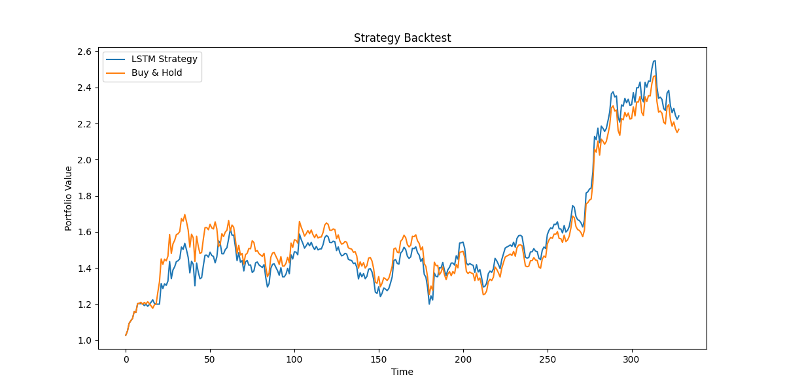

# LSTM-based Bitcoin Trading Strategy

## Overview
This project explores whether an LSTM can extract predictive information from historical Bitcoin market data and evaluates the resulting threshold-based backtest.

### Project Workflow
```
Data Collection
    ↓
Feature Engineering
    ↓
LSTM Prediction
    ↓
Signal Generation
    ↓
Backtesting
    ↓
Performance Evaluation
```

## Dataset
- Asset: BTC-USD
- Source: Yahoo Finance
- Period: 2020–2025
- Frequency: Daily

## Features
### Technical Indicators
- RSI
- MACD
- MACD Signal
- Moving Averages
- EMA
- Volatility
### Market Features
- Close Price
- Volume
- Returns

## Model Architecture
```
Input Sequence (30 Days)
          ↓
      LSTM
          ↓
 Fully Connected
          ↓
     Sigmoid
          ↓
 Upward Probability
 ```

## Trading Semantics
```
Model output: probability of Target = 1

Probability > 0.52 → raw threshold label +1
Probability < 0.48 → raw threshold label -1
Otherwise → raw threshold label 0

Frozen backtest exposure = -raw threshold label
Raw +1 → exposure -1
Raw -1 → exposure +1
Raw 0 → exposure 0
```

The threshold label is not itself a long or short position. The current
backtest intentionally applies contrarian exposure and calculates returns as
`exposure * next-day market return`.

## Result
| Metric       | Strategy | Buy & Hold |
| ------------ | -------- | ---------- |
| Sharpe Ratio | 1.672    | 1.547      |
| Max Drawdown | 0.306    | 0.262      |


## Findings
- Target engineering matters more than model complexity
- Financial prediction is extremely noisy
- Trading evaluation is more important than prediction accuracy

## Known Limitations
- Evaluation uses one fixed holdout period rather than walk-forward validation.
- Backtest returns exclude transaction costs and slippage.
- Reported performance does not establish that the strategy is profitable or deployable.
- Sharpe annualization uses `sqrt(252)` even though BTC trades daily.

## LLM Client
The isolated LLM client reads `LLM_PROVIDER`, `LLM_MODEL`, and provider API
keys from the environment or local `.env` file. It supports `openai` and
`gemini`, and is not called by the LSTM, trading, or backtest pipeline.

```bash
python -c "from src.llm.client import LLMClient; print(LLMClient(provider='gemini').generate('Explain RSI in one sentence.'))"
```

## Deterministic Financial Tools
The `tools` package exposes JSON-safe, directly callable adapters for market
data, project-defined technical indicators, LSTM inference, and risk metrics.
They do not call an LLM; LLM tool calling is planned for a later phase.

```python
from tools.risk_metrics import get_risk_metrics

print(get_risk_metrics([0.01, -0.005, 0.02]))
```

Run direct examples with `PYTHONPATH=src` in this script-style project.

# Results

